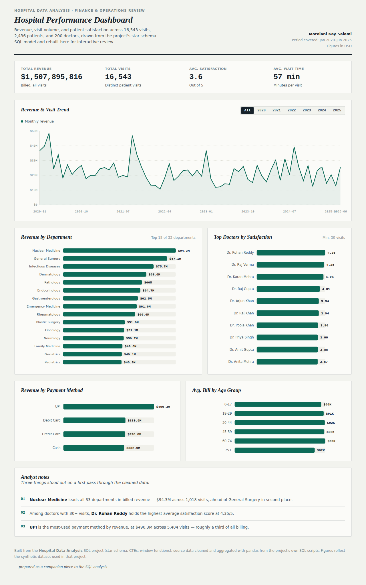

# Hospital Data Analysis

A SQL data warehouse and analytics project built on a synthetic hospital dataset. The project takes raw, denormalized hospital records, models them into a clean star schema, and answers real operational and business questions using SQL — from patient demographics to doctor performance to revenue trends.

## Overview

- **Database:** MySQL
- **Scale:** ~16,500 patient visits (2020–2025), 2,436 patients, 200 doctors
- **Focus areas:** Data modeling, data cleaning, and analytical querying (joins, CTEs, window functions)

## Dashboard

Live: https://mkaysalami.github.io/Hospital-Data-Analysis/dashboard/



**Key findings**
- Nuclear Medicine leads all 33 departments in revenue ($94.3M across 1,018 visits)
- Dr. Rohan Reddy holds the highest average satisfaction (4.35/5) among doctors with 30+ visits
- UPI is the most-used payment method by revenue ($496M across 5,404 visits)

**Tools:** MySQL (star schema, CTEs, window functions), Python/pandas (cleaning & aggregation), HTML/SVG/JavaScript (interactive dashboard)

## Project Structure

```
HospitalData/
├── HospitalDB.sql                          # Database creation
├── Resources/
│   ├── Hospital_CreateTable.sql            # Raw schema (dimension + yearly fact tables)
│   ├── Hospital_Insert_Patient_Doctors_Data.sql
│   ├── Hospital_Insert_Dept_Treatment_Diagnosis_PayMethod_Data.sql
│   └── Hospital_Insert_PatientVisits_Data.sql
├── HospitalData_CleanCode/
│   ├── DIM_Patient_CleanCode.sql           # Name casing, location split, gender normalization
│   ├── DIM_Department_CleanCode.sql        # Department field standardization
│   └── DIM_PatientVisit_CleanCode.sql      # Consolidates 4 yearly visit tables into one
├── Hospital_Data Exploration.sql           # 10 analytical queries
└── dashboard/
    ├── index.html                          # Interactive dashboard (revenue, visits, satisfaction)
    └── dashboard_preview.png               # Screenshot for this README
```

## Data Model

The raw data is organized into a star schema:

- **Dim_Patient** — patient demographics
- **Dim_Doctor** — doctor details and years of experience
- **Dim_Department** — department, category, and specialization
- **Dim_Diagnosis** — diagnosis lookup
- **Dim_Treatment** — treatment lookup
- **Dim_PaymentMethod** — payment method lookup
- **PatientVisits** (fact table) — one row per visit, linking all dimensions, with billing, insurance, satisfaction, and wait-time metrics

Raw visit data originally arrived split across four separate yearly tables (`PatientVisits_2020_2021`, `PatientVisits_2022_2023`, `PatientVisits_2024`, `PatientVisits_2025`); these are consolidated into a single `PatientVisits` table via `UNION ALL`.

## Data Cleaning

- Standardized patient first/last names to proper case
- Split a combined `CityStateCountry` field into separate `City`, `State`, and `Country` columns
- Normalized inconsistent gender codes (`M`/`F`/etc.) into `Male`/`Female`
- Standardized department naming and category fields
- Merged four yearly visit tables into one unified fact table

## Analysis

`Hospital_Data Exploration.sql` answers 10 business questions, including:

1. Distinct patients treated per doctor
2. Revenue and visit volume by payment method
3. Average bill amount by patient age group
4. Revenue and visit volume by department
5. Department revenue ranked within each department category (window function)
6. Average satisfaction score and wait time by department
7. Weekday vs. weekend visit volume
8. Monthly visit counts with a running cumulative total (window function)
9. Doctors with the highest average satisfaction score (minimum 100 visits)
10. Most commonly prescribed treatment per diagnosis (ranked per diagnosis)

These queries make use of `JOIN`s, `CASE` statements, `CTE`s, and window functions (`RANK() OVER`, running totals with `SUM() OVER`).

## How to Run

1. Run `HospitalDB.sql` to create the database.
2. Run `Resources/Hospital_CreateTable.sql` to create the raw tables.
3. Run the three `Resources/Hospital_Insert_*.sql` scripts to load the raw data.
4. Run the three scripts in `HospitalData_CleanCode/` to build the cleaned dimension tables and consolidated `PatientVisits` fact table.
5. Run the queries in `Hospital_Data Exploration.sql` against the cleaned schema.

## Tech Stack

SQL, MySQL, Data Warehousing (star schema), Window Functions
